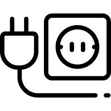
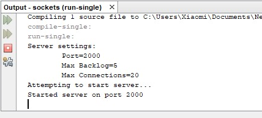
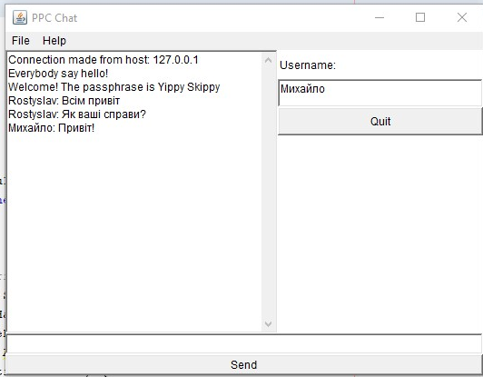
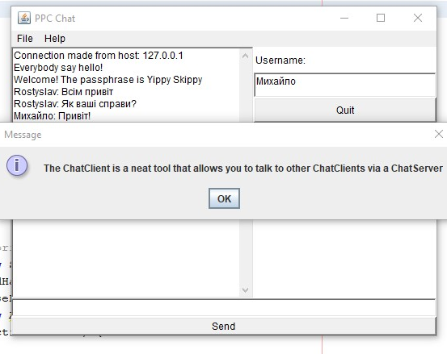

# Створення сокет-клієнта

### Завдання на "п'ять"
1. позбавтесь від використання **файлу хостів** в коді сервера (розберіться як він працює та змініть так аби позбавитись помилок при його запуску)
2. реалізуйте підтримку кирилиці - кодування **UTF-8** (потрібну для цього інформацію ви знайдете [тут](http://tutorials.jenkov.com/java-io/inputstreamreader.html)) 

---
**УВАГА! Не забувайте завантажувати результати виконання робіт до своїх репозиторіїв!**

 
